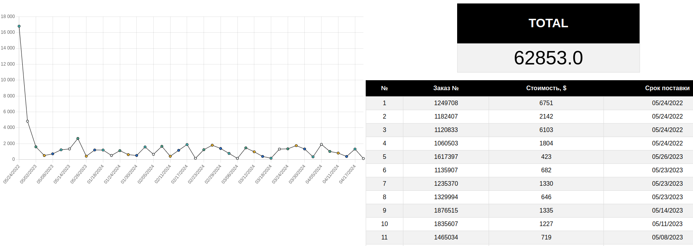

# О проекте

Данный проект отображает график стоимости заказов относительно срока поставки, таблицу всех заказов и общую стоимость заказов на веб-странице, а также посылает уведомления в Telegram чат о просроченных заказах. Данные для построения графика берутся из google sheets где имеются столбцы с данными о *№ заказа*, *стоимости заказа в $* и *сроке поставки*, после этого данные обрабатываются (стоимость переводится в рубли по текущему курсу ЦБ) и сохраняются в базу данных, данные в базе обновляются с заданной частотой. Веб-страница сверстана по заданному заказчиком шаблону и построена с использование Flask + React.



## Запуск проекта

Для запуска проекта необходимо в корне проекта отредактировать файл `.env`. В файле следует указать следующие переменные:

```python
AUTH_SERVICE_FILE = 'file.json' # файл авторизации через сервисный аккаунт в console.cloud.google.com
SHEETS_NAME = 'sheets_name' # наименование таблицы в Google Sheets, из которой будут браться данные
POSTGRES_DB = 'db_name' # имя базы данных Postgres
POSTGRES_USER = 'db_user' # имя пользователя базы данных
POSTGRES_PASSWORD = 'db_pass' # пароль пользователя базы данных
TELEGRAM_TOKEN = 'token' # токен телеграм-бота
TELEGRAM_CHAT_ID = 'chat_id' # id чата, в который бот будет отправлять информацию (бот должен быть добавлен в данный чат)
```

Для запуска проекта необходимо скачать или склонировать данный репозиторий и выполнить команду `docker compose build` из корня проекта для его сборки. После завершения сборки можно запустить проект с помощью команды `docker compose up`.